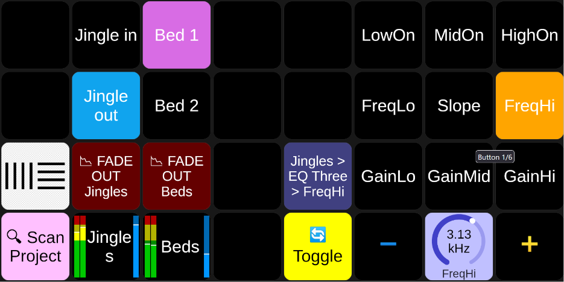

# Companion Module for Ableton Live (OSC)

> [!WARNING]
> Starting from version **2.x.x**, this module requires Companion **5+**.
> If you want to use it with Companion 4.x, choose version **1.2.2**
>
> Upgrading from 1.x: the **Track Meter Visual** feedback (PNG bargraph drawn on the button) is gone.
> Meters, volume and parameter values are now native Companion **gauge** elements bound to variables —
> see the ready-made presets in `Tracks / [Track]` and `Controls`.

This module allows you to control Ableton Live via OSC using the [AbletonOSC](https://github.com/ideoforms/AbletonOSC) control script.

It offers advanced visual feedback, including clip names, colors, and real-time audio meters directly on your Stream Deck buttons.

My main usage of Ableton Live in a broadcast workflow is to play out audio clips, automate track fades and other events based on camera tally states, and set parameters on plug-ins to adjust audio effects live.

If you need to control Ableton Live as a music producer, [**AbleSet**](https://ableset.app/) and its [**Companion module**](https://github.com/matlantin/companion-module-ableset) might be a better fit.



## Documentation

* [**Installation & Setup**](docs/INSTALL.md): How to install the remote script and configure Companion.
* [**Usage Guide**](docs/USAGE.md): Detailed list of Presets, Actions, Feedbacks, and Variables.
* [**Advanced Fading**](docs/FADE_BY_STATE.md): Tutorial on using "Fade Track by State" with triggers (e.g., Camera Tally).

## Development

```sh
yarn install
yarn smoke      # offline checks: definitions, presets, action/feedback callbacks, OSC handling
yarn format     # prettier
yarn package    # build a .tgz for Companion
```

`yarn smoke` runs the module against a fake Companion instance and a simulated Ableton project,
without opening a socket. It reproduces the definition validation the Companion host performs at
startup, so the warnings it would print in the Companion log show up in the terminal instead.

## Support

Enjoying this module? Feel free to buy me a coffee! ☕

<a href="https://www.buymeacoffee.com/matlantin" target="_blank"></a>
